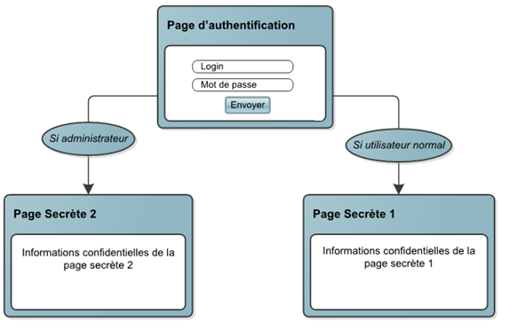

# Exercice Session

Créer trois pages selon le schéma :

- Créer la page "login.php" qui demande à l’utilisateur la saisie de son login et son mot de passe dans un formulaire
- On suppose avoir deux utilisateurs :
  - Login = 'User' ; Mot de passe = 'User123'
  - Login = 'Admin' ; Mot de passe = 'Admin123'
- L'admin peut accéder à toutes les pages alors que User ne peut accéder qu'à la page secrete_1.php seulement.
- Afficher dans les pages secrètes un message de bienvenue avec le login de l’utilisateur et un lien pour la déconnexion.
